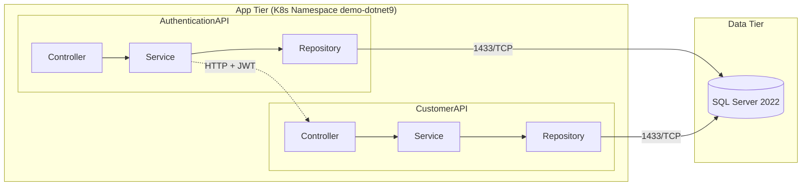

# DemoDotNet9API &nbsp;     

> **Portfolio‑ready demo** showing a minimal Layer Architecture with **AuthenticationAPI** & **CustomerAPI** that share a SQL Server database and communicate via JWT.

---

## ✨ Key Features

| Area | Details |
|------|---------|
| **Authentication** | Username / password validation & JWT issuing (`AuthenticationAPI`) |
| **Customer Data** | Secured endpoint returning customer profile (`CustomerAPI`) |
| **Layer Architecture** | Controllers ➜ Services ➜ Repositories ➜ DataAccess with EF Core |
| **Observability** | Structured console logs via **Serilog**; `/health` endpoint for liveness |
| **CI/CD & Containers** | Docker‑ready *per API* images built by GitHub Actions workflow |
| **Unit Tests** | Separate *xUnit* projects with high coverage for service layer |

---

## 🛠️ Tech Stack

- **.NET 9** / **ASP.NET Core** APIs  
- **Entity Framework Core**
- **MSSQL Server** 2022 (container)  
- **Serilog** console sink  
- **xUnit** + **Stub** for tests  
- **Docker** & **GitHub Actions**

---

## 🗂️ Project Structure (high‑level)



---

## 📚 REST Endpoints

| API | Verb | Path | Auth | Purpose |
|-----|------|------|------|---------|
| AuthenticationAPI | `POST` | `/api/login/userauthen` | ➖ | Validate credentials & issue JWT |
| AuthenticationAPI | `GET`  | `/api/healthcheck/status` | ➖ | Service health probe |
| CustomerAPI | `POST` | `/api/generalinfo/getcustomerdata` | **Bearer** | Return customer profile |

### 🔑 Sample Payloads

<details>
<summary><strong>POST /api/login/userauthen</strong></summary>

```json
// request
{
  "userName": "demo.user",
  "password": "P@ssw0rd"
}

// response
{
  "status": 200,
  "success": true,
  "message": "Login success",
  "token": "eyJhbGciOiJIUzI1NiIsInR5..."
}
```
</details>

<details>
<summary><strong>POST /api/generalinfo/getcustomerdata</strong> (Authorization: Bearer {token})</summary>

```json
// request
{
  "customerId": "CUS-001"
}

// response
{
  "status": 200,
  "success": true,
  "data": {
    "customerId": "CUS-001",
    "fullName": "Demo User",
    "email": "demo@company.com",
    "lastLogin": "2025-04-22T15:04:00Z"
  }
}
```
</details>

---

## 🚀 Quick Start

```bash
# 1. clone & change directory
git clone https://github.com/tanapoomjaisabay/DemoDotNet9API.git
cd DemoDotNet9API

# 2. spin up MSSQL + both APIs
docker compose -f infrastructure/docker-dotnet9/docker-compose.yml up -d
```

Visit **Swagger UI**:

* AuthenticationAPI → <http://localhost:5001/swagger>
* CustomerAPI → <http://localhost:5002/swagger>

---

## 🤝 Contributing

PRs are welcome! Feel free to open issues, suggest refactors, or add new features.

---

## 📜 License

Distributed under the **MIT** license. See `LICENSE` for more info.
